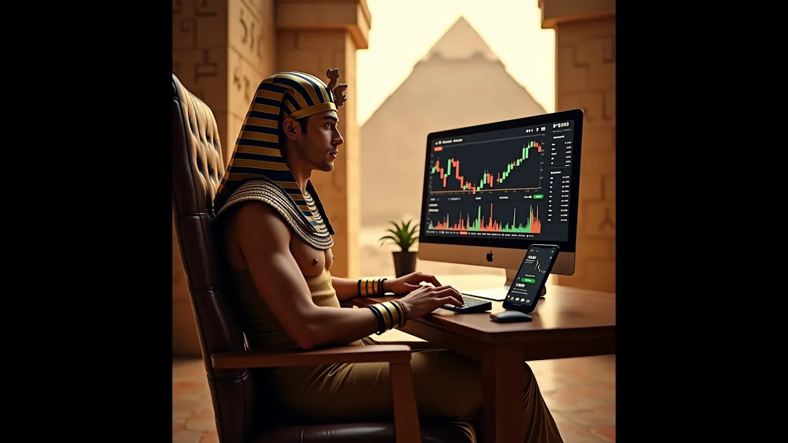

---
date: '2025-03-02'
title: 'Pavanatom, o Faraó do capital'
---

[Video](https://www.youtube.com/watch?v=cO1LDEPLrYU)

[Música]
no Vale do
nilo lá vem
pavana com seu fetinho de ouro proteção
contra o monstro abort
Tom Dizem que ele é o faraó do capital
acumulando tesouros no Egito
ancestral pavana Tom o faraó do
Capital com suas riquezas capitalistas
sem
igual o faraó é o mestre do comércio no
Egipto antigo já previa
Bitcoin nesse mercado ele já propõe
enquanto os
Camponeses colam o trigo pavana como
acumulava a capital seu mundo era seu
umbigo com suas pirâmides e pedras
preciosas ele governava o Egito com
ganância grandiosa
do
Capital com suas riquezas capitalistas
sem
igual o faraó é o mestre do comércio no
Egito antigo já previa Bitcoin L carado
ele já
propõe quando criança era seu principal
brinquedo
com ela cavava buracos o dia inteirinho
mas de Machado tinha medinho um dia caiu
no buraco e quase
morreu depois com raiva o buraco ele
vendeu bana com o faraó do
Capital com suas riquezas capitalistas
sem igual
o faraó é o mestre do comércio no Egito
antigo já previa bitco nesse mercado ele
já
[Música]
propõe e assim o Egito o mito se
espalhou
pana Tom O Faraó que capital
acumulou ele foi esquecido mas seu
descendente o
relembrou um garoto chamado Lucas que
com sua história num debate lacrou
[Música]